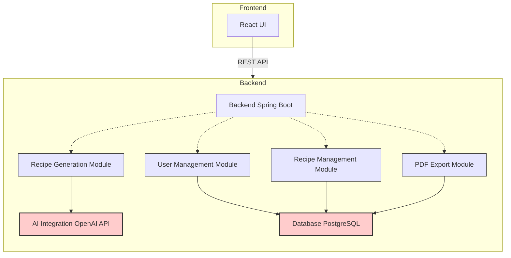

# Діаграма архітектури системи "Personalized Recipe Generator"

```mermaid
flowchart TB
 subgraph Frontend["Frontend"]
        React["React UI"]
  end
 subgraph Backend["Backend"]
    direction TB
        SpringBoot["Backend Spring Boot"]
        RecipeGen["Recipe Generation Module"]
        UserMgmt["User Management Module"]
        RecipeMgmt["Recipe Management Module"]
        PDFExport["PDF Export Module"]
        OpenAI["AI Integration OpenAI API"]
        DB["Database PostgreSQL"]
  end
    React -- REST API --> Backend
    SpringBoot -.-> RecipeGen & UserMgmt & RecipeMgmt & PDFExport
    RecipeGen --> OpenAI
    UserMgmt --> DB
    RecipeMgmt --> DB
    PDFExport --> DB

    style RecipeGen fill:#e6e6ff,stroke:#333,stroke-width:1px
    style UserMgmt fill:#e6e6ff,stroke:#333,stroke-width:1px
    style RecipeMgmt fill:#e6e6ff,stroke:#333,stroke-width:1px
    style PDFExport fill:#e6e6ff,stroke:#333,stroke-width:1px
    style OpenAI fill:#ffcccc,stroke:#333,stroke-width:2px
    style DB fill:#ffcccc,stroke:#333,stroke-width:2px
```