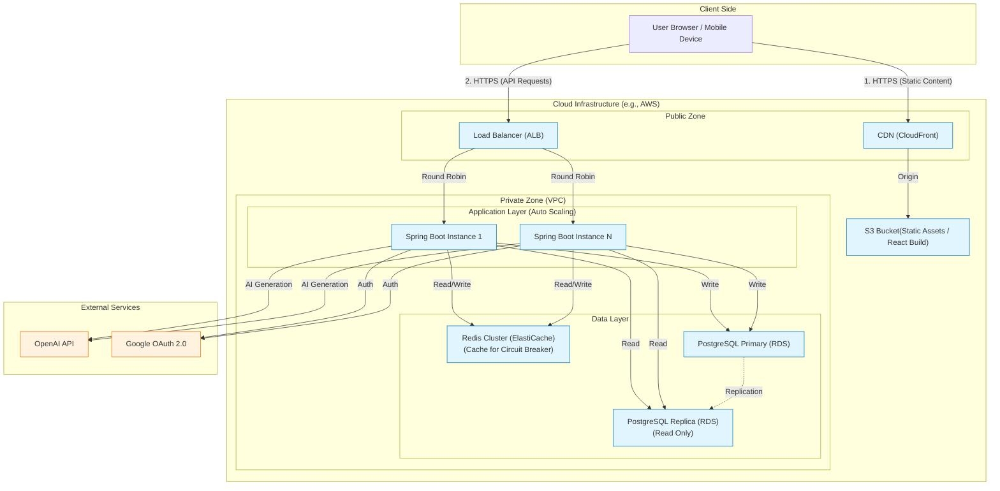

```mermaid
flowchart TB
 subgraph subGraph0["Client Side"]
        Browser["User Browser / Mobile Device"]
  end
 subgraph subGraph1["Public Zone"]
        CDN["CDN (CloudFront)"]
        LB["Load Balancer (ALB)"]
  end
 subgraph subGraph2["Application Layer (Auto Scaling)"]
        AppInstance1["Spring Boot Instance 1"]
        AppInstance2["Spring Boot Instance N"]
  end
 subgraph subGraph3["Data Layer"]
        Redis["Redis Cluster (ElastiCache)(Cache for Circuit Breaker)"]
        DB_Primary["PostgreSQL Primary (RDS)"]
        DB_Replica["PostgreSQL Replica (RDS)\n(Read Only)"]
  end
 subgraph subGraph4["Private Zone (VPC)"]
        subGraph2
        subGraph3
  end
 subgraph subGraph5["Cloud Infrastructure (e.g., AWS)"]
        subGraph1
        subGraph4
        S3["S3 Bucket(Static Assets / React Build)"]
  end
 subgraph subGraph6["External Services"]
        OpenAI["OpenAI API"]
        GoogleAuth["Google OAuth 2.0"]
  end
    Browser -- "1. HTTPS (Static Content)" --> CDN
    CDN -- Origin --> S3
    Browser -- "2. HTTPS (API Requests)" --> LB
    LB -- Round Robin --> AppInstance1 & AppInstance2
    AppInstance1 -- Auth --> GoogleAuth
    AppInstance2 -- Auth --> GoogleAuth
    AppInstance1 -- AI Generation --> OpenAI
    AppInstance2 -- AI Generation --> OpenAI
    AppInstance1 -- Read/Write --> Redis
    AppInstance2 -- Read/Write --> Redis
    AppInstance1 -- Write --> DB_Primary
    AppInstance2 -- Write --> DB_Primary
    AppInstance1 -- Read --> DB_Replica
    AppInstance2 -- Read --> DB_Replica
    DB_Primary -. Replication .-> DB_Replica

     CDN:::component
     LB:::component
     AppInstance1:::component
     AppInstance2:::component
     Redis:::component
     DB_Primary:::component
     DB_Replica:::component
     S3:::component
     OpenAI:::external
     GoogleAuth:::external
    classDef cloud fill:#f9f9f9,stroke:#333,stroke-width:2px
    classDef component fill:#e1f5fe,stroke:#0277bd,stroke-width:1px
    classDef external fill:#fff3e0,stroke:#ef6c00,stroke-width:1px
```