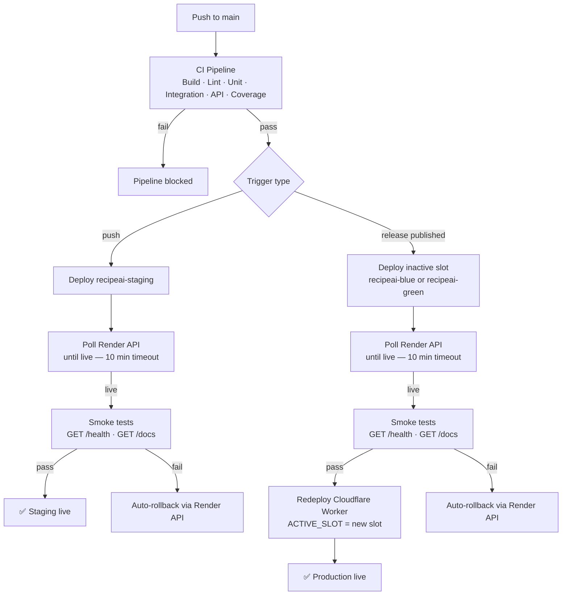

# CD Process — RecipeAI

## Overview

RecipeAI uses a **Blue-Green deployment strategy** on **Render.com**, with a separate staging environment acting as a mandatory QA gate. All deploys are orchestrated by GitHub Actions; Render's `autoDeploy` is disabled on every service. Traffic switching between production slots is controlled by a **Cloudflare Worker** whose `ACTIVE_SLOT` environment variable determines which Render service receives traffic.

---

## Architecture



---

## Services

All services are defined in [`render.yaml`](../render.yaml) and provisioned as a Render Blueprint.

| Service | Role | Plan |
|---|---|---|
| `recipeai-staging` | QA gate — receives every push to `main` | free |
| `recipeai-blue` | Production blue slot | free |
| `recipeai-green` | Production green slot | free |
| `recipeai-staging-db` | Staging PostgreSQL | free |
| `recipeai-production-db` | Production PostgreSQL — shared by both slots | free |
| `recipeai-production-secrets` | Env-var group shared by blue and green | — |

Blue and green slots share `recipeai-production-db` and `recipeai-production-secrets` so that JWT tokens remain valid across slot switches.

---

## Environments

| | Staging | Production |
|---|---|---|
| **Render services** | `recipeai-staging` | `recipeai-blue`, `recipeai-green` |
| **Database** | `recipeai-staging-db` | `recipeai-production-db` |
| **DB_SYNCHRONIZE** | `true` — schema auto-migrated | `false` — manual migrations only |
| **NODE_ENV** | `staging` | `production` |
| **Deploy trigger** | Every push to `main` | Every published GitHub release (release-please) |

---

## Deployment Triggers

| Event | Target |
|---|---|
| Push to `main` | `recipeai-staging` |
| GitHub Release published (release tag) | Inactive production slot (blue or green) |
| Manual workflow dispatch | Any environment, any time |

Render's `autoDeploy: false` is set on all services. GitHub Actions is the sole authority that initiates builds.

---

## Pipeline Stages

### CI (`ci-tests.yml`)

Runs on every push. Stages run sequentially and must all pass before the CD job proceeds:

1. **Build & Lint** — TypeScript compilation + ESLint
2. **Unit Tests** — Jest, isolated modules
3. **Integration Tests** — Jest against a real PostgreSQL instance
4. **API Tests** — end-to-end HTTP against the running service
5. **Coverage** — threshold enforcement

### CD (`deploy.yml`)

Runs after CI passes. The active job depends on the trigger type:

**Staging deploy (every push to `main`)**

1. Render build triggered via API (`POST /v1/services/{id}/deploys`)
2. Pipeline polls `GET /v1/services/{id}/deploys/{deployId}` until `status = live` or the 10-minute timeout expires
3. Smoke tests run against the staging URL
4. On failure: automatic rollback to the previous live deploy

**Production deploy (release published)**

1. The currently inactive slot is identified and targeted
2. Render build triggered on the inactive slot
3. Pipeline polls until `status = live` or timeout
4. Smoke tests run against the inactive slot's URL
5. On success: Cloudflare Worker KV is updated to point traffic at the newly deployed slot
6. On failure: automatic rollback; the active slot is never touched

---

## Smoke Tests

Executed after every successful Render build:

| Endpoint | Expected response |
|---|---|
| `GET /health` | `200 OK` |
| `GET /docs` | `200`, `301`, or `302` |

A non-matching status code on either endpoint triggers the automatic rollback procedure.

---

## Rollback

### Automatic (smoke test failure)

When smoke tests fail after a deploy, the CD pipeline:

1. Queries the Render API for the previous deploy with `status = live`
2. Calls `POST /v1/services/{id}/deploys/{deployId}/rollback`
3. Records the outcome in the GitHub Actions run summary

The active production slot is unaffected during a production rollback — traffic continues to be served by the slot that was live before the deploy started.

### Manual (emergency)

A manual rollback can be triggered at any time via **GitHub Actions → RecipeAI — CD → Run workflow**, selecting the target environment. This executes the `manual-rollback` job, which calls the same Render rollback API against the specified service.

As a secondary option, any deploy can be rolled back directly through the Render Dashboard (**Deploys** tab → **Rollback to this deploy**) without involving GitHub Actions.

---

## GitHub Secrets

The following secrets must be present in the repository for the CD pipeline to function:

| Secret | Purpose |
|---|---|
| `RENDER_API_KEY` | Authenticates all Render API calls |
| `RENDER_STAGING_SERVICE_ID` | Identifies the `recipeai-staging` service (`srv-…`) |
| `RENDER_BLUE_SERVICE_ID` | Identifies the `recipeai-blue` service (`srv-…`) |
| `RENDER_GREEN_SERVICE_ID` | Identifies the `recipeai-green` service (`srv-…`) |
| `CLOUDFLARE_ACCOUNT_ID` | Cloudflare account ID |
| `CLOUDFLARE_API_TOKEN` | Token with Workers Scripts edit permission |

---

## Configuration

### Environment variables

Service-level environment variables are declared in `render.yaml` under each service's `envVars` block. Variables shared between blue and green are defined in the `recipeai-production-secrets` env-var group.

Variables that must not be committed (credentials, generated values) use `generateValue: true` in `render.yaml` or are injected from GitHub Secrets at deploy time.

### Adding a variable

- **Staging only** — add to `recipeai-staging.envVars` in `render.yaml` and push
- **Both production slots** — add to the `recipeai-production-secrets` group in `render.yaml`
- **CI/CD pipeline only** — add as a GitHub Actions secret; it is not visible to the running service

---

## Monitoring

### Render metrics

The Render Dashboard exposes per-service metrics: CPU, memory, response time, request volume, and full deploy history.

### Health endpoint

`GET /health` — available on both environments; checks database connectivity.

```json
{
  "status": "ok",
  "info": {
    "database": { "status": "up" }
  }
}
```

Returns `503` when the database is unreachable.

### GitHub Actions summary

Every CD run produces a summary containing:

- Deploy status (`live` / `failed`)
- Service URL
- Commit SHA
- Smoke test results
- Rollback details (if triggered)

---

## Docker Image

The application is packaged as a multi-stage Docker image:

| Stage | Base image | Output |
|---|---|---|
| `builder` | `node:20-alpine` | `dist/` (compiled NestJS) |
| `runtime` | `node:20-alpine` | Minimal production image |

Runtime stage characteristics:

- Production dependencies only (`npm ci --omit=dev`)
- Static frontend (`UI_prototype/`) copied to `public/` and served by `ServeStaticModule` at `/`
- Non-root user (`appuser`)
- `HEALTHCHECK` via `wget /health`
- Entrypoint: `node dist/main`

API routes (`/api`, `/auth`, `/health`, `/docs`) take priority over static file serving.

---

## Release Process

Semantic versioning is managed automatically by `release-please` (`release.yml`):

| Commit prefix | Version bump |
|---|---|
| `feat:` | minor — `1.x.0` |
| `fix:` | patch — `1.0.x` |
| `feat!:` or `BREAKING CHANGE:` | major — `x.0.0` |

When commits are merged to `main`, `release-please` opens or updates a Release PR. Merging the Release PR creates a GitHub Release and the corresponding tag, which triggers the production CD job.
